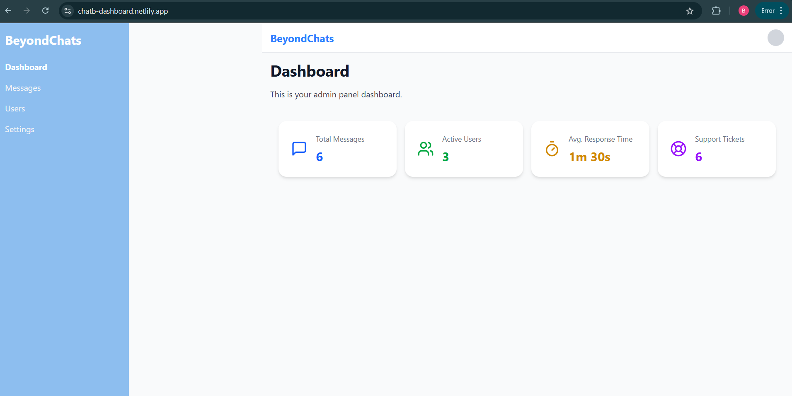
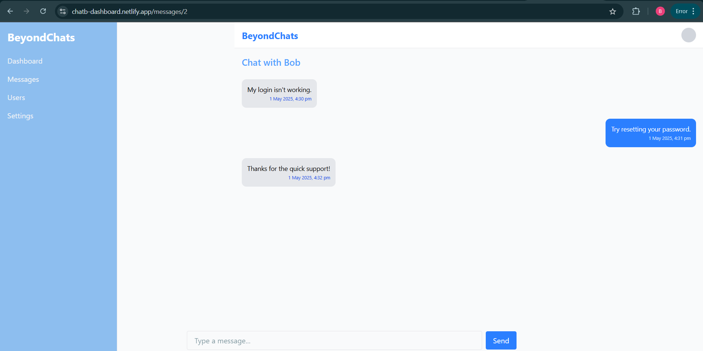

# BeyondChats Admin Panel

This is a responsive Admin Dashboard built as part of an assignment for the **BeyondChats** paid internship program. It is inspired by **Intercom’s AI-enhanced admin panel** demo, with an emphasis on clean UI, intuitive UX, and mobile responsiveness.

## 🚀 Live Demo

🔗 [Click here to view the live site](https://chatb-dashboard.netlify.app/)

## 📂 GitHub Repository

🔗 [GitHub Repo](https://github.com/Bablu558/beyondchats-admin-panel)

## 📸 Screenshots

### Dashboard


### Chat UI


## ✅ Features Replicated from Demo

- Interactive chat interface with conversation list and message panel
- Message layout with timestamps, user avatar, and user details
- Sidebar navigation with icons and routes
- Dashboard metrics/statistics using dummy data
- Settings, Reports, Tickets, and Users pages
- Top bar with navigation and user options
- Mobile responsive layout with smooth transitions
- Framer Motion-based animations for enhanced UX

## 🛠 Tech Stack

- **Next.js 15** (App Router)
- **React 19**
- **Tailwind CSS 4**
- **shadcn/ui**
- **Lucide Icons**
- **Framer Motion**

## 🧰 Installation & Running Locally

```bash
git clone https://github.com/Bablu558/beyondchats-admin-panel
cd beyondchats-admin-panel
npm install
npm run dev
